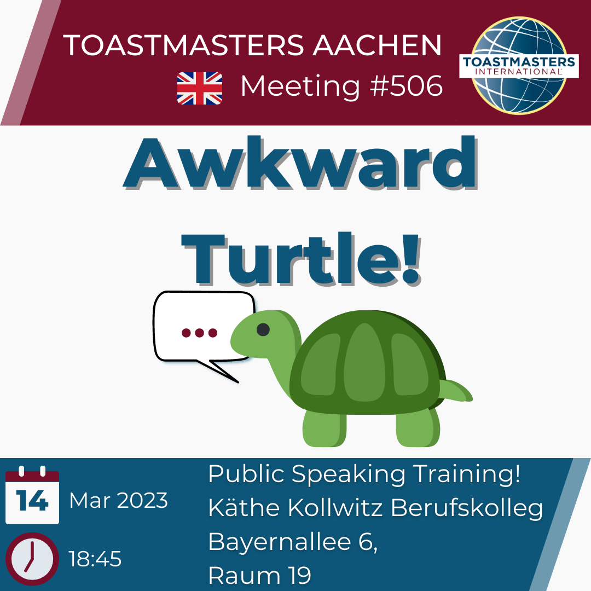

# Willkommen bei den Toastmasters Aachen!

Verbessere deine Rede- und Präsentationsfähigkeiten in einer lebendigen und unterstützenden Community!

# Unser nächstes Treffen

<b>Termin:</b> Dienstag, 28. März 2022, 18:45 Uhr  

<b>Ort:</b>

Käthe-Kollwitz-Berufskolleg, Bayernallee 6, 52066 Aachen 

# Quick Links to get you started!

<a href="https://tmclub.eu/clubdata.php?c=728">EasySpeak</a> - Our weekly meeting management tool!  (Members only access)

<a href="https://www.toastmasters.org/education/pathways">Toastmasters Basecamp and Pathways</a> - Our Education Program, complete with Instructions, Assessments and Evaluations!

<a href="https://toastmasters-95.org"> District 95 </a> - Our District Website!

<a href="https://www.toastmasters.org">Toastmasters.org</a> - The international Website!

# Warum Toastmasters Aachen?

## Vom Zitteraal zum Vortragskünstler!

Lampenfieber vor einer Rede?
Schweißausbrüche oder andere Nervositätsanzeichen plagen dich vor einer Präsentation?
Unsicher wie dein Vortrag beim Publikum angekommen ist?
Das muss nicht länger sein!

Bei den Toastmasters Aachen üben wir regelmäßig das Sprechen und Präsentieren vor Publikum.
Dank des konstruktiven Feedbacks unserer Mitglieder hast du dabei die Möglichkeit, deine Fähigkeiten kontinuierlich auszubauen und dich selbst besser kennenzulernen.

## Wann?

Jeden Dienstag um 18:45 Uhr.

## Wo?

Raum 19 - Käthe-Kollwitz-Schule, Bayernallee 6, 52066 Aachen
(Gegenüber der FH und um die Ecke der Katholischen Hochschule)
